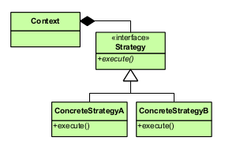
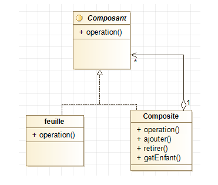
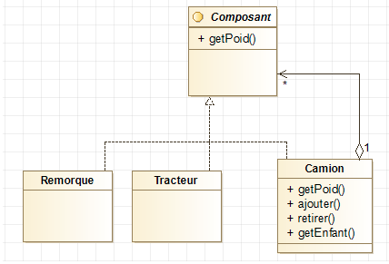

# TP Patterns

## Strategy

Faire les 3 exercices décrits dans `01-strategy/README.md`

## Composite

Faire les 3 exercices décrits dans `02-composite/README.md`

## Visitor

Faire les 2 exercices décrits dans `03-visitor/README.md`

## Conclusion

**A Faire**: Ecrire un rapport (3000 caractères minimum):

- Expliquer l'intérêt des design patterns
- Donner un autre exemple (cas d'usage) de **Strategy** et en expliquant pourquoi c'est adapté
- Donner un autre exemple (cas d'usage) de **Composite** et en expliquant pourquoi c'est adapté
- Donner un autre exemple (cas d'usage) de **Visitor** et en expliquant pourquoi c'est adapté

### Conclusion

En développement informatique, un design pattern est une solution d’implémentation reconnue comme bonne pratique en 
réponse à un problème de conception connu et cela indépendamment du langage de programmation. Un design pattern est
souvent accompagné d’un schéma UML. De plus, le design pattern décrit les 
grandes lignes d'une solution, qui peuvent ensuite être modifiées et adaptées en fonction des besoins.
L’utilisation d’un design pattern a de nombreux avantages tels que l’accélération du processus de développement, 
l’évitement de la redondance du code, la lisibilité du code, mais également l’anticipation des problèmes pouvant 
survenir plus tard car non visibles au moment du développement et enfin la modularité du code (réadaptation et 
extensibilité du code).

### Strategy

Un problème qu’un développeur peut rencontrer est que le comportement d'une classe ou son algorithme peut être modifié 
au moment de l’exécution. Le design pattern Strategy permet de répondre à la problématique : comment faire pour réaliser
différentes opérations avec un seul et même objet ?
Nous pourrions créer une classe avec toutes les opérations mais cela violerait un principe SOLID. Pour éviter cela, nous
pouvons structurer nos classes de la manière suivante : 
- Créer des objets qui représentent diverses stratégies
- Créer un objet de contexte dont le comportement varie en fonction de son objet de stratégie
- L'objet de stratégie modifie l'algorithme d'exécution de l'objet de contexte.

Voici un schéma possible du design Strategy : 

Un exemple concret serait la navigation d’un utilisateur sur un site d'e-commerce. Un article intéresse l’utilisateur, 
il veut l’acheter, et l’ajoute donc à son panier. Il ouvre son panier, puis, le site demande d'effectuer l'action 
abstraite de "payer". Il est possible de payer de différentes manières : directement par carte de paiement, par Paypal, 
etc. La méthode "payer" peut être implémentée de différentes manières : c'est là l'intérêt du pattern Strategy.

### Composite

Lorsqu’un développeur veut créer des objets composés, il doit créer une classe par objet. De plus pour supprimer un 
élément d’un objet, il faut directement aller dans le code de sa classe. Alors comment faciliter la gestion de cet 
ensemble d’objets ?

Le design pattern Composite permet de répondre à ce problème en gérant un ensemble d’objets en tant qu’un seul et même
objet, autrement dit, un objet composé de plusieurs autres. Ce pattern permet d’additionner les propriétés des 
différents objets (par exemple un prix) pour en composer un seul et même prix. Il simplifie les compositions car on peut
ajouter ou supprimer des éléments d’un objet composé grâce à des méthodes, sans avoir à modifier le code de leurs classes. 

Voici un schéma du design pattern Composite : 

Pour illustrer cela, nous pouvons prendre l’exemple d'un camion semi-remorque. En effet, ce dernier est composé d’un 
tracteur et d’une remorque, qui ont chacun un poids, si pris séparément. Il faut également prendre en compte le poids du
« camion en entier » (poids du tracteur + poids de la remorque). De plus, un tracteur routier doit pouvoir rouler sans 
remorque. Voici un diagramme représentatif d’un camion semi-remorque avec utilisation du pattern Composite :

 
### Visitor 

Le design pattern Visitor permet d’appliquer des comportements spécifiques à un ou plusieurs objets et d’être sûr que 
tous les types d’objets sont pris en compte. En effet, ce pattern permet de séparer les données et les traitements 
associés pour ces données. 

Ce modèle permet à une classe d’être informée du type exact d’instances d’un ensemble de 
classes. Il est également possible de créer des opérations pouvant être appliquées à la classe visitée sans avoir à en 
modifier le code ou alors ajouter de nouveaux traitements sans toucher à la hiérarchie des objets.
Dans ce pattern, chaque classe pouvant être « visitée » met à disposition une méthode publique « accepter », prenant 
comme argument un objet « visiteur ». La méthode « accepter » appelle la méthode « visiter » de l’objet du type 
« visiteur » avec pour argument l’objet visité. Ainsi, un objet visiteur peut connaître la référence de l’objet visité 
et appeler ses méthodes publiques pour obtenir les données nécessaires au traitement à effectuer (calcul, affichage, 
etc.).

Un exemple illustrant ce design pattern peut être l’utilisation d’une liste hétérogène d’objets, telle qu’une liste de 
véhicules : voiture, moto, etc. Les comportements « ajouter des passagers » et « ajouter des bagages » sont appliqués 
sur ces objets.

Il faut donc avoir un comportement spécifique à un type de véhicule, ajouter les comportements cités ci-dessus, ajouter 
un nouvel objet de type « véhicule » prenant en compte tous les comportements et enfin implémenter les nouveaux 
comportements sans modifier les objets (sans casser le principe de responsabilité unique).

Le pattern Visitor répond à ce problème en considérant les objets visités (les véhicules) et les visiteurs 
(les comportements). Les comportements sont donc implémentés dans une classe séparée. Pour permettre l’application des 
comportements, les objets visités comportent une fonction permettant « d’accepter » la visite des visiteurs.
